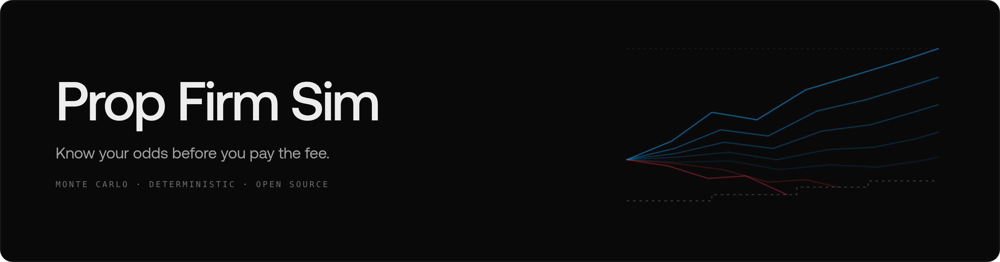
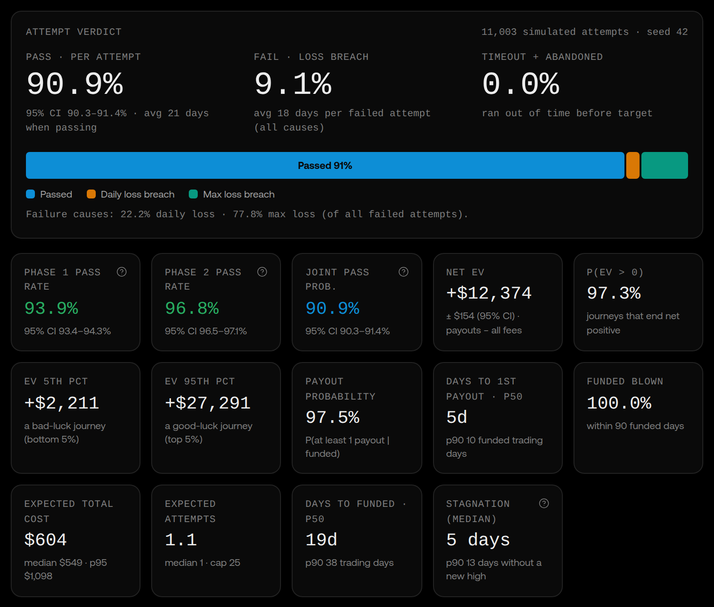
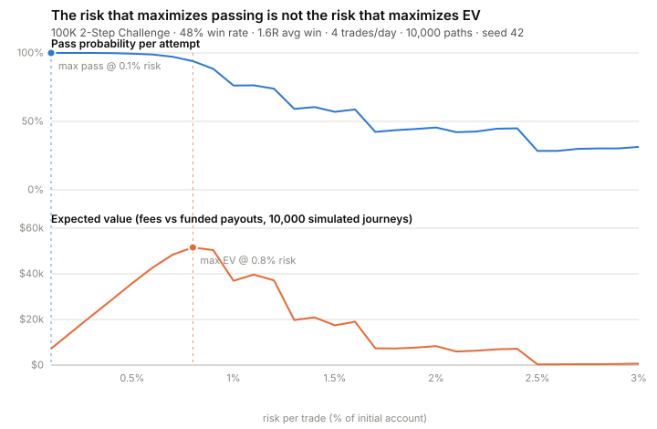
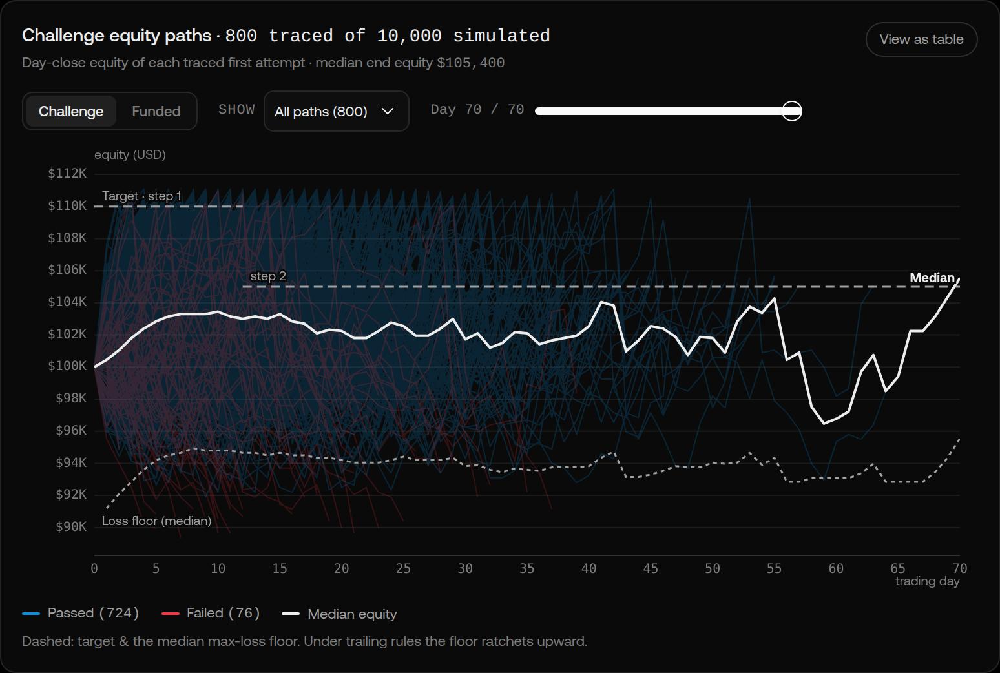
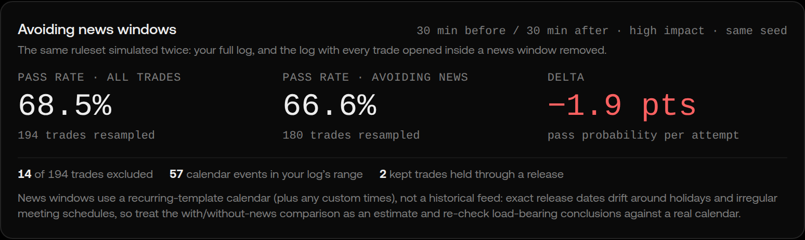
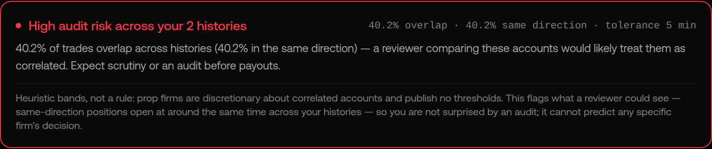

<p align="center">
  
</p>

<p align="center">
  <sub><b>Prop Firm Sim</b> is a <a href="https://www.luxalgo.com">LuxAlgo</a> open-source project. Official repository: <a href="https://github.com/LuxAlgo/prop-firm-sim">github.com/LuxAlgo/prop-firm-sim</a></sub>
</p>

<p align="center">
  <a href="https://github.com/LuxAlgo/prop-firm-sim/actions/workflows/ci.yml"></a>
  <a href="https://www.npmjs.com/package/@luxalgo/prop-firm-sim-core"></a>
  <a href="./LICENSE"></a>
</p>

<p align="center">
  <a href="#thirty-seconds-to-your-odds">Quickstart</a>&ensp;·&ensp;
  <a href="#why-your-odds-are-worse-than-you-think">Why your odds are worse</a>&ensp;·&ensp;
  <a href="#run-it-on-your-real-trades">Your real trades</a>&ensp;·&ensp;
  <a href="#the-same-engine-three-ways">Packages</a>&ensp;·&ensp;
  <a href="#where-the-rules-come-from">Rules data</a>&ensp;·&ensp;
  <a href="./docs/rule-semantics.md">Method</a>
</p>

<br>

Prop Firm Sim tells you your odds before you pay for a prop-firm challenge. Give it your
trading statistics, or your actual trade history, and it plays ten thousand complete challenge
journeys through the firm's exact ruleset. Out come the numbers that matter: pass probability
per phase and joint, with confidence intervals. Expected attempts, total cost, and expected
value with every fee priced in. Time to funding, stagnation, and the probability a funded
account ever collects a payout.

The engine is pure, deterministic TypeScript: everything runs locally, and the same seed
reproduces the same numbers byte for byte. Firm rules come live from
[LuxAlgo's public prop-firm directory](https://www.luxalgo.com/prop-firms/) (keyless,
read-only), and any ruleset can be passed inline, fully offline.

## Thirty seconds to your odds

```bash
npx @luxalgo/prop-firm-sim-cli simulate \
  --firm ftmo --challenge 100k-2step \
  --winrate 0.48 --avg-win 1.6 --avg-loss 1 \
  --risk 1% --trades-per-day 4
```

```text
FTMO · FTMO Challenge 100K (2-step)
ftmo/100k-2step · cfd · account 100,000 USD · fee 540 USD one-time
Data: live LuxAlgo directory · provenance directory, every simulated rule read from a structured
directory column
Trader: win rate 48.0% · avg win 1.6R · avg loss 1R · 4 trades/day · risk 1% of balance per trade
Run: 10,000 paths · seed 42 · attempt cap 25 · engine 1.0.0

Pass probability per attempt                  93.2% (95% CI 92.7–93.7%)
  Step 1 · target +10%                        96.5% (95% CI 96.2–96.9%) · fails: max-loss 3.5%
  Step 2 · target +5%                         96.6% (95% CI 96.2–96.9%) · fails: max-loss 3.4%
Avg days per attempt                          16.5 when passed · 16 when failed

Funded within 25 attempts                     100.0% (95% CI 100.0–100.0%)
Attempts until funded                         mean 1.1 · p50 1 · p90 1
Total cost                                    mean 39.26 USD · p50 0 USD · p90 0 USD · p95 540 USD
Cost when funded                              mean 39.26 USD · p50 0 USD · p90 0 USD
Days to funded (trading days)                 p50 15 · p75 22 · p90 31
Stagnation (days without a new equity high)   p50 4 · p90 12

EV · challenge journey + funded horizon of 90 trading days
  EV total                                    +66,755 USD ± 589 USD (95% CI)
  P(EV > 0)                                   96.2%
  Payout if funded                            mean 66,794 USD · p50 71,011 USD · avg 6.8 payout events
  Payout probability | funded                 96.2%
  Days to 1st payout                          p50 10 · p90 10
  Funded accounts blown                       26.0% within the horizon
Max drawdown while evaluating                 p50 5.9% · p95 12.5% of initial balance

Not simulated / assumptions:
  • trades-resolve-same-day: All trades are modeled as same-day round trips; overnight and weekend
    holding are not simulated.
  • intra-trade-excursions-not-modeled: Equity is observed at each trade close; favorable/adverse
    excursions inside a trade are not modeled, which slightly understates trailing-drawdown and
    open-PnL breach risk (real odds are somewhat worse).
  ...five more flags follow: every run prints the full assumptions list and the disclaimer.
```

That trader is good. Profit factor near 1.5, and the static max loss still kills 3.5% of
step-one attempts, while 26% of the funded accounts blow up within 90 trading days. Drop the
win rate three points (the built-in sensitivity panel shows exactly this) and the picture
darkens fast.

Prefer a browser? The same run in [the hosted simulator](https://www.luxalgo.com/prop-firms/):

<p align="center">
  
</p>
<p align="center"><sub><b><a href="https://www.luxalgo.com/prop-firms/">The hosted simulator</a></b> after one run: verdict, per phase and joint pass rates, EV with fees priced in, and the stagnation tile. Everything runs client side; nothing you enter leaves your browser.</sub></p>

## Why your odds are worse than you think

Every prop-firm calculator you have seen multiplies a win rate into a binomial formula. That
number is wrong, and wrong in the house's favor, because the odds do not live in the profit
target. They live in the exact mechanics of the loss rules.

1. **"Trailing drawdown" is four different rules.** A max loss that is static from the initial
   balance, one that trails end-of-day highs, one that trails peak unrealized equity intraday,
   and one that trails then locks at breakeven are wildly different odds wearing the same
   headline number. The intraday variant, standard on futures evaluations, routinely cuts pass
   probability by a third versus the static rule at the same limit.
   [The semantics, with pen-and-paper examples.](./docs/rule-semantics.md)

2. **A "5% daily loss" is four choices multiplied together.** Five percent of what, anchored to
   which day-start number, counting open P&L or not, checked live or only at the close. Same
   headline, different survivors. Every switch is explicit in the spec schema.

3. **Your trades come in streaks; the naive math assumes they do not.** Streaks are exactly what
   breach daily-loss and trailing rules. Paste your real R-multiples and the engine
   block-bootstraps them, preserving your autocorrelation. With a tight loss limit, i.i.d. math
   overstates your pass probability, and the flattery lands exactly where the rules bite.

4. **The risk that maximizes passing is not the risk that maximizes EV.** Passing wants small
   risk, to survive the floors. EV wants more, because fees are fixed and payouts scale. Here
   is that curve, from a realistic two-step ruleset, reproducible with one command:

<p align="center">
  
</p>

```bash
npx @luxalgo/prop-firm-sim-cli optimal-risk --firm ftmo --challenge 100k-2step \
  --winrate 0.48 --avg-win 1.6 --trades-per-day 4 --seed 42
```

5. **You probably overestimate your win rate.** Every simulate run can carry a sensitivity
   panel: what one percentage point of win-rate optimism costs you in pass probability. It is
   usually a lot.

6. **Getting funded is not getting paid.** Consistency rules are simulated: one outsized day
   raises your effective target, and the extra days at risk are sometimes the days the trailing
   floor gets hit. So is payout gating: winning-day minimums, profit buffers, per-payout caps.
   Results report the probability a funded account ever collects a payout, and how long the
   first one takes.

7. **Dead time is part of the price.** Every result reports stagnation: the longest stretch of
   days without a new equity high inside an attempt. Cutting risk raises your pass odds and
   stretches your stagnation. Surviving is slow, and slow is what makes traders abandon
   accounts and force trades.

The centerpiece of the hosted simulator draws all of this at once: 800 traced equity paths
against the ruleset's actual moving loss floor. Under trailing rules you can watch the floor
ratchet up beneath the paths.

<p align="center">
  
</p>

## Run it on your real trades

Summary stats are a start. Timestamps are the truth. Paste or upload your trade history: real
platform exports import directly (TradingView list of trades, MT4/MT5 statements including the
HTML reports, MT5 deals tables, ThinkOrSwim account statements), along with plain timestamped
CSVs, a documented generic template, and broker trade history as JSON in the open-source
[@luxalgo/broker-sdk](https://github.com/LuxAlgo/broker-sdk) shape, so a live broker pull drops
straight into the simulator. Files that carry P&L but no risk data are refused until
you state the risk you took per trade: R-multiples are computed, never fabricated. With
timestamps in hand, two more questions become answerable:

**What if I stop trading around news?** Prop firms restrict or frown on positions opened around
scheduled releases, and some pay out only if you avoided them. The news filter replays your log
with every trade opened inside a configurable window (minutes before and after, impact tier,
currency) removed, on a recurring release calendar, then simulates both versions with the same
seed. You see the delta, not a lecture. Sometimes avoiding news costs you probability, and the
card says so.

<p align="center">
  
</p>

**Would a combined portfolio get me audited?** Upload up to five strategy histories for one
simulation. Before merging them chronologically, the overlap audit counts same-direction
positions open at the same time across histories, exactly what a payout reviewer looks for in
copied accounts, and flags the risk with disclosed heuristic bands before you find out the
expensive way.

<p align="center">
  
</p>

## The same engine, three ways

| Package                                                     | What it is                                                                                                                                                                |
| ----------------------------------------------------------- | ------------------------------------------------------------------------------------------------------------------------------------------------------------------------- |
| [`@luxalgo/prop-firm-sim-core`](./packages/core)            | The engine. Pure TypeScript, zero I/O, browser and worker safe, deterministic under seed (permalinks reproduce byte for byte). 10,000 paths in about a third of a second. |
| [`@luxalgo/prop-firm-sim-cli`](./packages/cli)              | `simulate`, `optimal-risk`, `compare`, `overlap`, `firms`, `rules` in your terminal, on live directory data or inline specs.                                              |
| [`@luxalgo/prop-firm-sim-mcp`](./packages/mcp)              | MCP server exposing the simulator to AI agents. Ask your assistant: given my last 200 trades, what are my odds on this challenge, and at what risk?                       |
| [the hosted simulator](https://www.luxalgo.com/prop-firms/) | The same engine in your browser, client side only, with precomputed reference odds per firm.                                                                              |

Use the core directly:

```ts
import { simulate } from "@luxalgo/prop-firm-sim-core";
import { adaptFirm } from "@luxalgo/prop-firm-sim-core/directory";

// Live rules from the LuxAlgo directory, or build the spec object yourself:
// the engine is pure and needs no network at all.
const { propfirms } = (await (await fetch("https://app.luxalgo.com/api/propfirms/list")).json()).data;
const challenge = adaptFirm(propfirms.find((f) => f.propfirmId === "ftmo"))[0];

const result = simulate(
  challenge.spec,
  {
    kind: "parametric",
    winRate: 0.52,
    avgWinR: 1.8,
    tradesPerDay: 3,
    risk: { mode: "percent-of-balance", value: 0.5 },
  },
  { paths: 10_000, seed: 42 },
);

result.perAttempt.passProbability; // with Wilson 95% CI alongside
result.perAttempt.stagnationDays; // dead time distribution per attempt
result.journey.cost.mean; // expected total cost to funded
result.ev.evTotal; // E[payouts minus fees] over the funded horizon
result.assumptions.flags; // every simplification, spelled out
challenge.provenance; // "directory" or "directory+inferred", inferred fields listed
```

Have real trade history? Feed a raw R-multiple series into bootstrap mode, or run any broker
export through `importTradeHistory` (structured diagnostics, adapter detection, a strict
R-provenance ladder; see [docs/trade-import.md](./docs/trade-import.md)) and a timestamped log
unlocks the context tools (`parseTradeLog`, `filterTradesAroundNews`, `mergeTradeLogs`,
`analyzeOverlap`). Your odds, from your actual trades, computed locally.

## Where the rules come from

Firm and challenge data is fetched at runtime from LuxAlgo's public prop-firm directory API
(`https://app.luxalgo.com/api/propfirms/list`, keyless and read-only, the data behind
[luxalgo.com/prop-firms](https://www.luxalgo.com/prop-firms/)), then adapted into simulatable
specs by [`@luxalgo/prop-firm-sim-core/directory`](./packages/core/src/directory) under a
three-tier honesty policy:

1. **Structured rule columns are used verbatim.** Exact drawdown mode, daily-loss anchor
   semantics, consistency caps, payout gating.
2. **Free text is inferred only when one reasonable reading exists**, and every inferred field
   is disclosed in the result (`provenance: "directory+inferred"`, `inferredFields: [...]`).
3. **Ambiguity is refused.** A challenge whose loss semantics cannot be established is reported
   as not simulatable instead of being guessed. The max-loss mode is too consequential to
   guess.

When the directory serves a source citation (`sourceUrl`, `lastVerifiedAt`), it passes through
into the spec's `sources` and every result. The data is data, not endorsement: no rankings, no
offers, no affiliate anything in any simulation result. Rules the engine cannot faithfully
simulate are declared (`flagsNotSimulated`) and echoed into every result rather than silently
dropped.

Firms change rules without notice. **The firm's page is always authoritative.** Found drift?
[Report it.](https://github.com/LuxAlgo/prop-firm-sim/issues/new/choose) And any ruleset,
including one the directory refuses or does not carry, can be passed inline as a `spec` object,
fully offline.

## Assumptions, owned loudly

The full list ships inside every result (`assumptions.flags`), but the big ones:

- Trades are same-day round trips; intra-trade excursions are not modeled. This slightly
  understates trailing-drawdown risk, so real odds are somewhat worse.
- Attempts are i.i.d. draws from your stated stats: no learning, no tilt.
- Consistency rules, payout gating (winning days, buffers, caps) and locking trails **are
  simulated**. Scaling plans and remaining firm-specific niceties are not; entries that have
  them say so, and results repeat it.
- The funded stage is a horizon simulation: withdrawals take the maximum the rules allow and
  never cross the loss floor; monthly billing approximates to 21 trading days.
- The news calendar is a recurring template, not a historical feed, and every filtered result
  says so.

Simulation, not prediction. Distributions, never promises.
**[Read the full disclaimer.](./DISCLAIMER.md)**

## Development

```bash
pnpm install
pnpm build          # topological: core, then cli and mcp
pnpm test:run       # unit tests incl. hand-computed micro-cases for every drawdown semantic
pnpm bench          # hot-loop benchmark
```

Engine changes that move simulated numbers must update the golden snapshots and justify
themselves in the PR. Silent drift in published odds is the one bug this repo treats as
unforgivable. See [CONTRIBUTING.md](./CONTRIBUTING.md).

## License

MIT © [LuxAlgo Global, LLC](https://luxalgo.com). Free to use, embed, fork, and verify. No
telemetry, no tracking, in any package. The project name and the LuxAlgo name and logo are
trademarks; see [TRADEMARKS.md](./TRADEMARKS.md). Security reports:
[SECURITY.md](./SECURITY.md).
